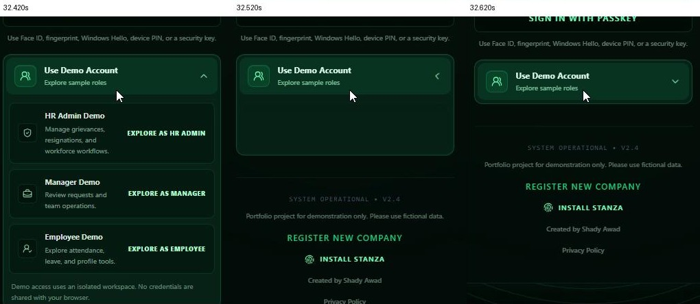
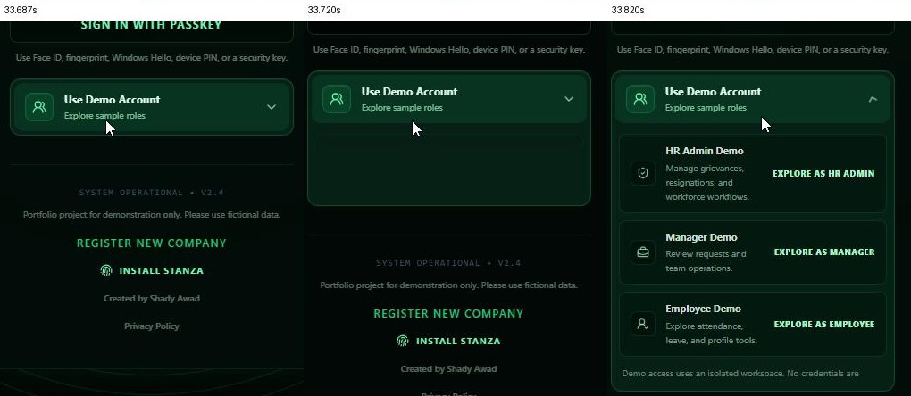

# Login regression investigation — 2026-09-24

Production behavior was not changed. Dashboard lanyard and Geo Operations code were not edited. Existing working-tree changes were preserved.

## Evidence status

The light-background regression is confirmed by Git history and live computed styles. The Demo Accounts regression is narrowed to a specific visual-change commit, but its transient black-flash mechanism is not yet confirmed. No Login-only Chromium Performance trace was available or captured; no CPU hot path, improvement, or all-three-known-good revision is claimed.

The video was unavailable during the initial investigation. The user subsequently supplied its local path; see the video follow-up below for consecutive-frame evidence. The original source-only conclusions below are retained with their measurement limitations.

## 1. Regression revisions

| Revision | Relevant evidence | Conclusion |
|---|---|---|
| `1b9920e` (2026-08-12) | Adds unconditional Emerald auth background `#020604` and auth text `#ecfdf5`. | Confirmed light-background regression. |
| `b0921cc` (2026-08-03) | Makes demo parent opaque; adds isolation, panel fill and opacity animation; changes trigger hover and adds pressed scale. | Primary Demo Accounts regression candidate, not a proven flash cause. Its commit title concerns lanyard, but this investigation reads only its Login changes. |
| `1725157` (2026-08-08) | Changes canvas color ownership from explicit dark/light colors to CSS auth tokens; introduces per-frame style lookup and per-ring RGB parsing. | Theme migration itself still supported light mode. Performance candidate in committed history; the working tree already caches these values. |
| `0bd1c7d` (2026-08-02) | Parent of `b0921cc`; grid-only demo animation, transparent panel, translucent parent, correctly light canvas. | Latest candidate immediately before the demo visual changes. Live light background verified; flash-free motion and acceptable performance remain unverified. |

Do not describe `0bd1c7d` as the most recent revision satisfying all three conditions. Source history and sampled screenshots cannot establish that claim. `1725157` is the immediate predecessor of the confirmed light regression, but already contains the demo changes.

## 2. Exact source diffs

These files are direct Git diff output, not reconstructed snippets:

- `demo-surfaces.diff`: `git diff b0921cc^ b0921cc -- src/pages/Login.tsx`
- `auth-token-migration.diff`: `git diff 1725157^ 1725157 -- src/components/AuthShell.tsx src/components/FingerprintCanvas.tsx`
- `theme-regression.diff`: `git diff 1b9920e^ 1b9920e -- src/index.css`
- `current-uncommitted-login.diff`: `git diff HEAD -- src/components/AuthShell.tsx src/components/FingerprintCanvas.tsx src/pages/Login.tsx`

The decisive light hunk changes the Emerald rule from ring/pulse tokens only to also include:

```css
--stanza-auth-background: #020604;
--stanza-auth-text: #ecfdf5;
```

The decisive demo panel change is:

```diff
- grid transition-[grid-template-rows] duration-[220ms] ease-out motion-reduce:transition-none
- open: [grid-template-rows:1fr]
- closed: [grid-template-rows:0fr]
+ grid bg-[#061f17] transition-[grid-template-rows,opacity] duration-[180ms] ease-out motion-reduce:transition-none
+ open: [grid-template-rows:1fr] opacity-100
+ closed: [grid-template-rows:0fr] opacity-0
```

In the same commit the parent changes from `bg-[rgba(6,31,23,0.72)]` to `isolate bg-[#061f17]`; the trigger adds `active:scale-[.99]` and replaces its hover fill. `min-h-0 overflow-hidden` remains unchanged.

## 3. Confirmed light-background cause and ownership

Current ownership: App mounts AuthShell, which owns the full-height background and a fixed, inset-zero canvas wrapper. FingerprintCanvas uses an opaque Canvas2D context (`alpha: false`) and fills the full viewport with the resolved auth-background token. Login itself is a transparent layout with a translucent card.

At `0bd1c7d`, AuthShell already owned the wrapper (introduced in `11aec93`), but the canvas chose `#020604` or `#f7fbf8` directly from the root `.dark` class. The shell behind it was dark, but the canvas painted the light background over it. Before AuthShell extraction, Login owned the decorative canvas.

At `1725157`, both shell and canvas consume `--stanza-auth-background`, initially derived from `--stanza-page-bg`. At `1b9920e`, the more specific, unconditional Emerald rule forces that token dark in light mode too. The canvas therefore faithfully paints the wrong resolved token. It is not a missing theme event or an SVG covering a correct light canvas.

Live working-tree observation in the in-app Chromium browser, after toggling light:

| Property | Observed value |
|---|---|
| Root class | empty; `.dark` removed |
| `data-theme` | `light` |
| `data-background-preset` | `emerald` |
| `--stanza-page-bg` | `#f4faf6` |
| `--stanza-auth-background` | `#020604` |
| AuthShell computed background | `rgb(2, 6, 4)` |

The screenshot showed a light card over the dark full-page canvas. The historical `0bd1c7d` build visibly changed the entire canvas to the pale light treatment. Login does not mount Dashboard's static `topography.svg` mask layers.

## 4. Demo Accounts: what is and is not established

Both expansion and collapse were exercised in the current and historical Login, without clicking a demo role or submitting credentials. Computed styles confirmed:

| Property | Current | `0bd1c7d` |
|---|---|---|
| Parent background | `rgb(6, 31, 23)` | `rgba(6, 31, 23, 0.72)` |
| Parent isolation | `isolate` | `auto` |
| Panel background | `rgb(6, 31, 23)` | transparent |
| Panel transition | grid rows and opacity | grid rows |
| Child clipping | hidden | hidden |

The historical closed grid resolved to `0px`. The current expanded grid measured `307.5px` in this viewport. These are layout observations, not timings.

Hard-coded dark color alone does not prove a transient flash: the current panel and parent have the same opaque color. Fading the panel reveals an equally colored parent; normal alpha blending of those two flat fills does not spontaneously create black. Row backgrounds include `bg-black/20`, which can change the intermediate appearance as content fades, but this is not proof of a compositor defect. The newly introduced opacity animation, isolation, and trigger transform must be distinguished from the changed fills. Overflow clipping predates the suspect commit and cannot be labelled the newly introduced cause by itself.

No frame-accurate recording or layer trace was captured. Sampled screenshots cannot certify the presence or absence of a 1–2-frame flash. The existing Login benchmark also instructs an expansion-only trial; its old observations do not validate collapse. Do not replace the grid animation on this evidence.

## 5. Login performance: evidence boundary

No measured hot path is established. The browser tool available in this session exposes DOM/computed-style reads and screenshots, but no DevTools tracing capability. Its read-only evaluation scope does not expose `performance` or the app's existing window measurement objects. An attempted runtime availability check returned `typeof performance === 'undefined'` in that tool scope; this does not mean the application itself lacks the Performance API.

Source inspection identifies work that a trace must attribute:

| Phase | Source-level work | Measurement status |
|---|---|---|
| Initial appearance | App bootstrap, module loading, provider effects, resize/palette observers, finite card entry animation, first canvas draws | Scripting/style/layout/paint/compositing breakdown unavailable |
| Moving between controls | Focus/hover transitions; input blur validation may update React; continuous visible canvas animation | No measured CPU or interaction latency |
| Demo opening | React toggle; grid-track layout interpolation; panel opacity; ancestor card geometry and backdrop sampling | No measured breakdown |
| Demo closing | Same transition in reverse; role buttons disabled immediately; clipping persists | No measured breakdown |
| Animation-frame callbacks | Canvas redraws gradient and distorted ring paths while visible; dev interaction wrapper adds bounded double-RAF timing after toggles | Cost share unknown |

The recurring canvas animation predates `0bd1c7d`, so its existence does not locate the performance regression. `1725157` adds `getComputedStyle` per frame and two RGB parses per ring; those operations are already removed from the current frame body by pre-existing working-tree changes. The user's unsuccessful canvas/blur isolations remain material evidence against declaring either the dominant cause without a trace.

The historical comparison used a Git archive in `build/login-history/0bd1c7d`, served on port 5174, alongside current code on port 5173. Both used installed current dependencies. This was an appearance comparison, not a dependency-locked historic performance benchmark. Backend authentication and PWA lifecycle behavior were not validated in these standalone Vite sessions.

## 6. Smallest restoration proposals (not applied)

1. **Light background:** keep the theme-token architecture and ring/pulse tokens. Scope Emerald's `#020604` background and `#ecfdf5` text overrides to non-light mode. Light mode then inherits the existing page/text tokens as it did immediately before `1b9920e`. This preserves the current intended dark treatment and other presets/custom tokens; it adds no new light palette.
2. **Demo Accounts:** first compare the exact `b0921cc` visual hunk against its parent under frame capture, including collapse. If the historical hunk removes the flash, isolate opacity, fill, isolation, and pressed transform individually before choosing the smallest reversal. The bounded restoration candidate is the prior translucent parent/transparent panel/grid-only 220ms presentation, retaining current handlers, roles, localization, accessibility state, passkeys, and all newer auth functionality. This is a candidate experiment, not a validated fix.
3. **Performance:** no production change justified yet. Capture current and `0bd1c7d` Login-only traces at identical viewport, DPR, theme, reduced-motion setting, browser, and build mode. Include startup, input/button movement, expansion, and collapse as separately identifiable intervals. Compare scripting stacks, Recalculate Style, Layout, Paint/raster, compositor activity, and animation-frame callbacks. Only restore or change the path shown to regress; do not revert newer auth or PWA functionality wholesale.

Next required evidence is a Login-only Chromium Performance trace from the affected browser (with the comparative historical run if available), plus a controlled visual comparison for the demo transition. No production changes were made because the requested diagnosis-before-change gate is not fully satisfied.

## Video follow-up — supplied recording inspected

Source: `C:/Users/10/Videos/Captures/New Tab - Google Chrome 2026-09-24 15-07-57.mp4`. Duration 43.736 seconds, 1920 × 1040 pixels, approximately 30 recorded frames/second. Decoded locally with PyAV; the source was not modified or uploaded. Frame timestamps below are presentation timestamps, not measured application event times. Extracts show only the relevant lower Login region.

The recording shows initial navigation from a Chrome new tab, Login interaction, a light-theme interval around 30 seconds, then repeated Demo Accounts expansion/collapse in dark mode around 32–40 seconds. The light interval shows a light card over a dark viewport, agreeing with the confirmed auth-token regression.

### Collapse sequence

- **32.420 s:** expanded role rows remain visible.
- **32.453–32.487 s:** the grid shrinks and role text/backgrounds fade.
- **32.520 s:** a substantial blank dark-green panel remains below the trigger, while role content is effectively invisible.
- **32.553 s:** a smaller blank strip remains.
- **32.587–32.620 s:** the panel reaches the collapsed presentation; the footer moves upward with the changing layout.



### Expansion sequence

- **33.687 s:** panel is still collapsed.
- **33.720 s:** the growing panel displays a blank dark region before readable role content appears.
- **33.753 s:** the first role becomes visible while much of the panel remains blank.
- **33.787–33.820 s:** additional rows become visible.



### Updated interpretation

The visible transient is localized to the Demo Accounts region in these sequences. The recording supports **content fading while grid height remains nonzero, exposing the persistent dark parent/panel fill** as the leading explanation. This is more specific than merely blaming a hard-coded color. It aligns with `b0921cc` introducing opacity and an opaque surface together. Expansion and collapse both show the same blank-intermediate-panel effect in reverse.

These sampled sequences do not show a full-viewport black frame or independently establish an unpainted compositor surface. They also do not prove that isolation, pressed scale, clipping, or backdrop sampling never contributes. The film cannot identify compositor layer promotion. A 30 fps capture can miss shorter transients.

The smallest next controlled experiment is to retain the current layout, duration, fills, and functionality while restoring the historical absence of panel opacity animation (panel opacity stays 1; only the grid track animates). Compare both directions on the affected Chrome setup. If that removes the recorded blank interval, the minimal fix is the historical grid-only presentation; no replacement animation or broad CSS workaround is needed. If it does not, compare the remaining exact historical surface/isolation/trigger changes. This experiment has **not** been applied to production code or validated here.

The video contains no Chrome Performance recording or CPU counters. Its frame cadence is the recording cadence, not measured application FPS; no scripting, style, layout, paint, compositing, or animation-callback cost can be inferred numerically from it. An all-three-known-good revision and measured performance hot path therefore remain unestablished.
